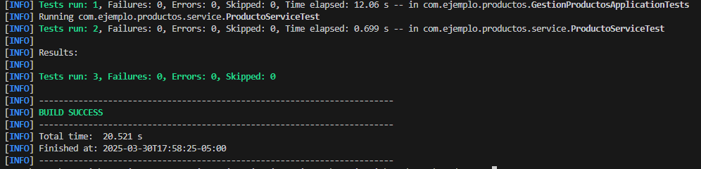
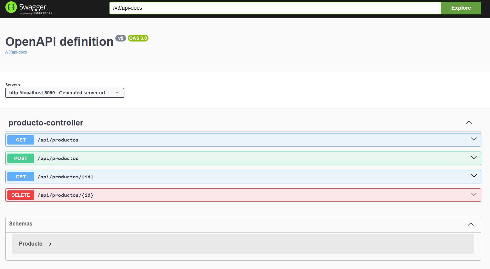
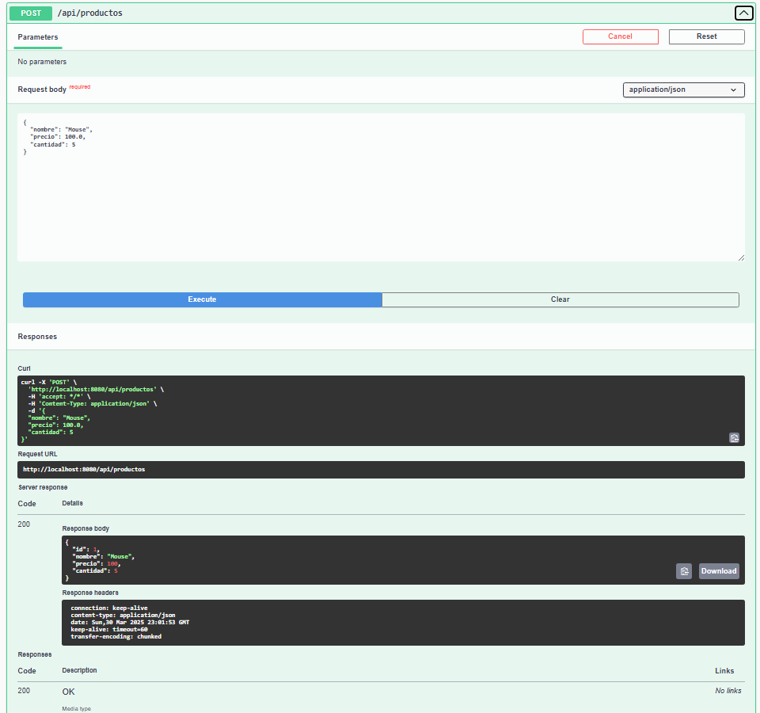
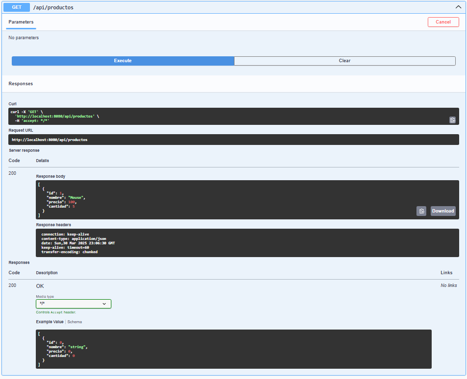
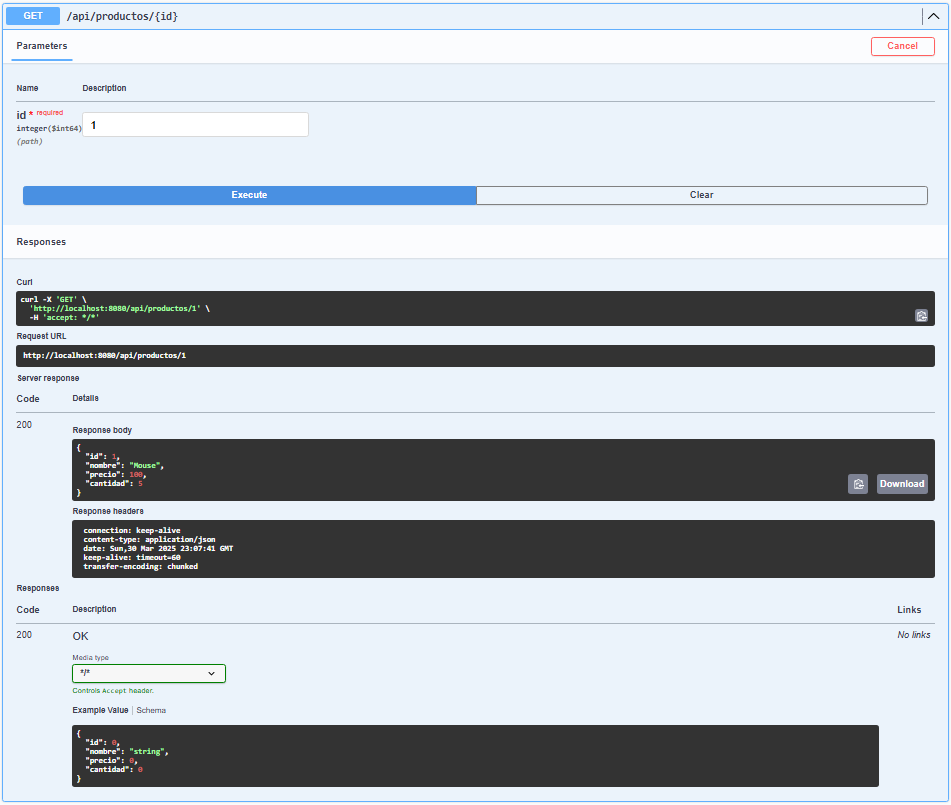
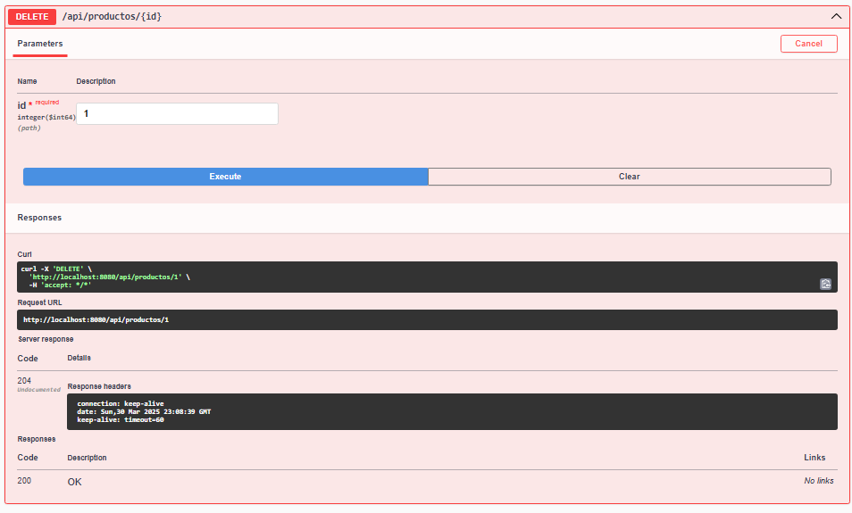

# Gestión de Productos - Spring Boot

Este proyecto es una API REST desarrollada con **Spring Boot** como parte del **Parcial 1B**. Permite realizar operaciones CRUD (Crear, Leer, Eliminar) sobre una entidad `Producto` almacenada en una base de datos en memoria H2. También incluye pruebas unitarias con JUnit y Mockito, y documentación automática con Swagger.

## Autor
**Leon Dario Builes Valencia**

---

## 🔧 Tecnologías Utilizadas

- Java 17
- Spring Boot 3.4.4
- Spring Web y Spring Data JPA
- Base de datos H2 en memoria
- JUnit 5 + Mockito (pruebas unitarias)
- Swagger UI (documentación)
- Maven Wrapper

---

## Instrucciones para Ejecutar el Proyecto

1. Clona este repositorio:
   ```bash
   git clone <url-del-repo>
   cd productos
   ```

2. Ejecuta la aplicación:
   ```bash
   ./mvnw spring-boot:run
   ```

3. Accede a Swagger UI:
   [http://localhost:8080/swagger-ui.html](http://localhost:8080/swagger-ui.html)

4. Accede a la consola de H2 (opcional):
   [http://localhost:8080/h2-console](http://localhost:8080/h2-console)
   - JDBC URL: `jdbc:h2:mem:testdb`
   - Usuario: `sa`
   - Contraseña: *(dejar vacío)*

---

## Pruebas Unitarias

Se realizaron pruebas unitarias del servicio `ProductoService` utilizando JUnit y Mockito. Estas pruebas verifican:

- Listado de productos (`listarProductos`)
- Búsqueda por ID (`obtenerProductoPorId`)

Para ejecutar las pruebas:
```bash
./mvnw clean test
```

---

## Evidencias del Desarrollo

### 1. Pruebas Unitarias

Captura de la ejecución de pruebas unitarias con `ProductoServiceTest`.

```bash
./mvnw clean test
```

 **Resultado esperado:**



>  **Captura**: 
> - Se ejecuta el comando en la terminal.
> - Esperamos que finalice y muestre el resumen con `BUILD SUCCESS`.
> - Se toma captura toda la sección donde se ve el resultado de los tests, con `Tests run: X, Failures: 0, Errors: 0`.

---

### 2. Operaciones CRUD desde Swagger

Evidencia del uso del cliente Swagger UI (`http://localhost:8080/swagger-ui.html`) para probar los siguientes endpoints:

- `GET /api/productos`
- `POST /api/productos`
- `GET /api/productos/{id}`
- `DELETE /api/productos/{id}`



#### Crear Producto



> **Instrucción**: Abre Swagger, despliega el endpoint `POST /api/productos`, llena los datos de ejemplo (nombre, precio, cantidad) y presiona "Execute". Captura el resultado con el cuerpo de la respuesta.

---

#### Listar Productos



> **Instrucción**: Ejecuta `GET /api/productos` desde Swagger. Captura el listado que aparece en el área "Response body".

---

#### Obtener Producto por ID



> **Instrucción**: Ingresa un ID existente en `GET /api/productos/{id}` y presiona "Execute". Captura el resultado.

---

#### Eliminar Producto



> **Instrucción**: Ejecuta el `DELETE /api/productos/{id}` con el mismo ID. Captura el resultado (debe ser 204 o sin contenido).

---

## Estructura del Proyecto

```
productos/
├── src/
│   ├── main/
│   │   ├── java/com/ejemplo/productos/
│   │   │   ├── controller/ProductoController.java
│   │   │   ├── model/Producto.java
│   │   │   ├── repository/ProductoRepository.java
│   │   │   └── service/ProductoService.java
│   │   └── resources/application.properties
│   └── test/
│       └── java/com/ejemplo/productos/service/ProductoServiceTest.java
├── evidencias/
│   └── [capturas de pantalla]
├── README.md
└── pom.xml
```

---

## Licencia

Este proyecto fue desarrollado para fines académicos como parte del **Parcial 1B** de la asignatura de **Lenguaje de Programación Avanzada 2**.

---

